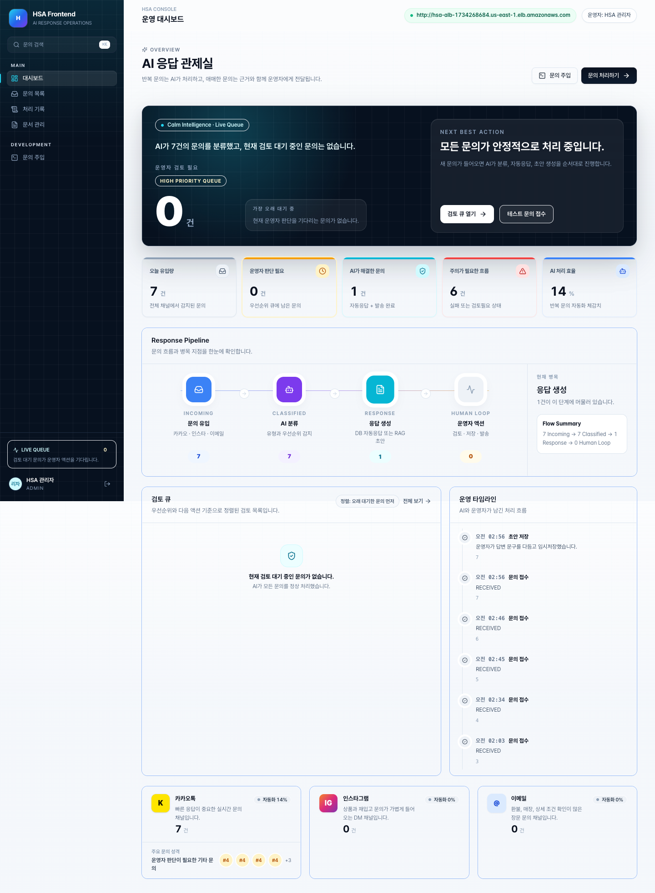

# HSA Frontend

HSA Frontend는 Hanyang Support Agent의 **AI 고객문의 운영 콘솔**입니다. 여러 채널에서 들어온 고객 문의를 백엔드와 AI 처리 파이프라인에 연결하고, 운영자가 분류 결과·답변 초안·처리 로그를 확인한 뒤 최종 답변을 검토/발송하는 흐름을 검증합니다.



## Highlights

- **Backend-first console**: MSW 런타임과 샘플 데이터를 제거하고 Spring 백엔드 API를 기본 실행 경로로 사용합니다.
- **운영자 중심 대시보드**: 문의 큐, 처리 단계, 운영 타임라인, 채널별 유입 현황을 한 화면에서 확인합니다.
- **문의 처리 워크플로우**: 문의 생성 → AI 처리 요청 → 초안 조회 → 운영자 수정 → 확정/발송 흐름을 연결했습니다.
- **백엔드 응답 어댑터**: Spring 공통 응답 래퍼(`isSuccess/code/message/result`)를 프론트 도메인 타입으로 변환합니다.
- **계약 미확정 영역 분리**: 문서 관리와 인증은 임시 가짜 구현 대신 명시적인 “API 계약 대기” 상태로 둡니다.

## Tech Stack

| 분류 | 사용 기술 |
|---|---|
| Framework | React 18, Vite 6, TypeScript 5.7 |
| Routing | React Router 6 |
| Styling | Tailwind CSS 3.4, CSS Custom Properties |
| Icons | Lucide React |
| Integration | Vite Dev Proxy, Fetch API |

## Architecture

```text
Customer Channel
Kakao / Instagram / Email
        │
        ▼
Frontend Admin Console
        │  /api/*
        ▼
Spring Backend
        │  /api/inquiries/process
        ▼
AI Service
        │
        ▼
DB / RAG / Processing Logs
```

프론트엔드는 AI 서버를 직접 호출하지 않습니다. 브라우저에 AI 서버 주소, API key, 내부 처리 정책이 노출되지 않도록 **Frontend <-> Backend <-> AI** 방향으로 연결합니다.

## Implemented Screens

| Route | Screen | Description |
|---|---|---|
| `/login` | 로그인 | 관리자 콘솔 진입 화면. 백엔드 인증 API 확정 전까지 로컬 운영자 세션 사용 |
| `/dashboard` | 대시보드 | 문의 큐, 처리 단계, 최근 로그, 채널별 현황 요약 |
| `/inquiries` | 문의 목록 | 채널/유형/상태/키워드 기반 문의 탐색 |
| `/inquiries/:id` | 문의 상세 | 원문, AI 판단 결과, 초안 편집, 임시저장/발송 액션 |
| `/logs` | 처리 기록 | 문의 처리 이벤트 타임라인 조회 |
| `/documents` | 문서 관리 | RAG 문서 관리 화면. 백엔드 문서 API 계약 대기 |
| `/dev/intake` | 문의 접수 테스트 | 개발용 문의 생성 및 AI 처리 트리거 |

## Backend Integration Status

프론트 개발 서버는 `/api/*` 요청을 `VITE_API_PROXY_TARGET`으로 프록시합니다. 브라우저 CORS 설정 없이 로컬 백엔드와 통합 테스트할 수 있습니다.

| Frontend Feature | Backend API | Status |
|---|---|---|
| 문의 목록 조회 | `GET /api/admin/inquiries` | Connected |
| 문의 상세 조회 | `GET /api/admin/inquiries/{id}` | Connected |
| 개발용 문의 생성 | `POST /api/inquiries` | Connected |
| AI 처리 요청 | `POST /api/inquiries/{id}/ai-processing` | Connected |
| 답변 임시저장 | `PATCH /api/admin/responses/{responseId}` | Connected |
| 답변 최종 확정 | `PATCH /api/admin/responses/{responseId}/confirm` | Connected |
| 답변 발송 | `POST /api/admin/responses/{responseId}/send` | Connected |
| 문의별 처리 로그 | `GET /api/admin/inquiries/{id}/logs` | Connected |
| 문서 관리 | - | Backend contract needed |
| 인증 세션 | - | Backend contract needed |

### Deployed Backend Verification

AWS ALB로 공개된 백엔드 Swagger와 API 응답을 확인했습니다.

```text
Frontend   : https://hsa-frontend-omega.vercel.app
Swagger UI : http://hsa-alb-1734268684.us-east-1.elb.amazonaws.com/swagger-ui/index.html
OpenAPI    : http://hsa-alb-1734268684.us-east-1.elb.amazonaws.com/api-docs
Health     : http://hsa-alb-1734268684.us-east-1.elb.amazonaws.com/health
Backend    : http://hsa-alb-1734268684.us-east-1.elb.amazonaws.com
```

확인 결과:
- `/health`가 `Server is running perfectly!`로 응답합니다.
- Swagger 기준 현재 프론트가 사용하는 문의/답변/로그 API가 배포 백엔드에 존재합니다.
- `GET /api/admin/inquiries`가 실제 RDS 데이터로 정상 응답합니다.
- 프론트 개발 서버에서 `VITE_API_PROXY_TARGET`을 ALB 주소로 바꿔 배포 백엔드 목록/상세 조회 화면을 확인했습니다.
- Vercel 배포에서는 `/api/*` rewrite로 HTTPS 프론트에서 HTTP ALB 백엔드를 프록시해 mixed content 차단을 회피했습니다.

### Local Integration Evidence

로컬 백엔드/H2/AI stub 구성에서도 통합 흐름을 확인했습니다.

```text
Frontend  : http://127.0.0.1:5173
Backend   : http://127.0.0.1:8080
AI stub   : http://127.0.0.1:8000
Database  : H2 in-memory test DB
```

검증한 흐름:

1. 프론트가 백엔드 API 엔드포인트로 실행됩니다.
2. 백엔드에 문의를 생성합니다.
3. 백엔드가 AI 처리 API를 호출합니다.
4. AI stub이 `/api/inquiries/process`에 `200 OK`로 응답합니다.
5. 백엔드가 AI 결과와 답변 초안을 저장합니다.
6. 프론트 대시보드와 문의 상세 화면에서 백엔드 데이터를 조회합니다.
7. 답변 수정, 확정, 발송 API를 호출합니다.

## Run Locally

### 1. Install dependencies

```bash
npm install
```

### 2. Configure backend target

```bash
cp .env.example .env.local
```

`.env.local`:

```env
VITE_API_PROXY_TARGET=http://hsa-alb-1734268684.us-east-1.elb.amazonaws.com
VITE_API_BASE_URL=
VITE_ADMIN_ID=1
VITE_CHANNEL_ID=1
VITE_TEST_CUSTOMER_ID=1
```

### 3. Start frontend

```bash
npm run dev
```

Vite dev server proxies `/api/*` to `VITE_API_PROXY_TARGET`.

## Scripts

| Command | Description |
|---|---|
| `npm run dev` | Start Vite development server |
| `npm run build` | Type-check and build production bundle |
| `npm run lint` | Run ESLint |
| `npm run preview` | Preview production build |

## Domain States

| Frontend Status | Label | Meaning |
|---|---|---|
| `received` | 접수 | 문의 수집 직후 |
| `classified` | 분류완료 | AI 유형 분류 완료 |
| `auto_replied` | 자동응답 | DB 조회로 즉시 발송됨 |
| `draft_ready` | 초안완료 | AI/RAG 초안 준비 완료 |
| `review_required` | 승인필요 | 운영자 검토 필요 |
| `saved` | 임시저장 | 운영자가 최종 답변을 저장한 상태 |
| `sent` | 발송완료 | 최종 답변 발송 완료 |
| `failed` | 실패 | 처리 실패 |

## Project Structure

```text
src/
├── components/       # Shared UI: Button, Badge, Table, Modal, Toast, etc.
├── layouts/          # AppShell navigation and top bar
├── pages/            # Route-level screens
├── lib/              # API client, formatters, metadata helpers
├── types/            # Domain types and labels
└── styles/           # Global styles and design tokens
```

## Related Documents

| Document | Path | Description |
|---|---|---|
| Feature Spec | `feature-spec.md` | 기능 ID별 상세 명세와 우선순위 |
| Wireframe | `hsa_admin_layout.md` | 화면별 텍스트 와이어프레임 |
| Figma Plan | `docs/figma-design-plan.md` | 디자인 시스템 및 Figma 제작 계획 |
